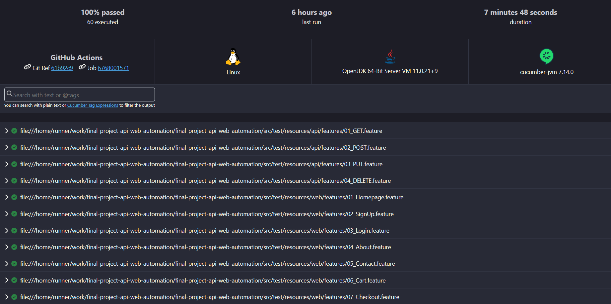

# FINAL PROJECT
# API Automation Test Framework using REST Assured and Web Automation Test Framework using Selenium

## Overview

This project provides two test frameworks for API and WEB automation testing. 
The API Automation Testing Framework uses REST Assured, while the Web Automation Test Framework uses Selenium. 
Both frameworks are integrated with Cucumber for behavior-driven development. 
Using Java and Gradle as the programming language and build tool.

- API for automation task : https://dummyapi.io/docs
- Web for automation task : https://www.demoblaze.com/

## Getting Started

These instructions will guide you on how to set up the project on your local machine for development and testing purposes.

### Prerequisites

Before getting started, ensure that you have the following software installed on your machine:

```
1. Java JDK: download and install the latest version of Java JDK from the official Oracle website (https://www.oracle.com/id/java/technologies/downloads/).
2. Gradle: Install Gradle by following the official Gradle installation guide (https://gradle.org/install/), but in this case, we are using 'gradlew'.

```

### Installing

To set up the development environment, follow these steps:

1. Clone this repository to your local machine using Git or download the ZIP file and extract it.
2. Open the project in your preferred Java IDE (e.g., IntelliJ or Eclipse).
3. Build the project and download dependencies using Gradle by running the following command in the terminal:

```
./gradlew build

```

## Running the tests

To execute the automated tests for both API and Web, run the following Gradle task:

```
./gradlew cucumber

```

To execute the automated tests for API only, run the following Gradle task:

```
./gradlew api

```

To execute the automated tests for web only, run the following Gradle task:

```
./gradlew web

```

These commands will run the Cucumber tests with the specified configurations and generate HTML test reports in the "reports" directory.

## Built With

- Selenium: The web automation library used for interacting with web elements and performing actions on web pages.
- Cucumber: A BDD testing framework that allows tests to be written in a natural language format (Gherkin) and executed using step definitions written in Java.
- Gradle: The build tool used for managing dependencies and building the project.

## Test Result

